# 数据库设计（论文素材：E-R 图与表结构）

## 1. E-R 图（mermaid erDiagram，可直接渲染）

```mermaid
erDiagram
    STUDENTS ||--o{ SESSIONS : "登录"
    STUDENTS ||--o{ COURSE_SELECTIONS : "选课"
    STUDENTS ||--o{ GRADES : "取得"
    STUDENTS ||--o{ EXAMS : "参加"
    STUDENTS ||--o{ FAVORITES : "收藏"
    STUDENTS ||--o{ CHECKLIST : "勾选"
    STUDENTS ||--o{ APPLICATIONS : "提交"
    COURSES ||--o{ COURSE_SELECTIONS : "被选"
    COURSES ||--o{ GRADES : "被考核"
    COURSES ||--o{ EXAMS : "被安排"
    GUIDE_ITEMS ||--o{ FAVORITES : "被收藏"
    GUIDE_ITEMS ||--o{ CHECKLIST : "被勾选"
    GUIDE_ITEMS ||--o{ APPLICATIONS : "被申请"

    STUDENTS {
        char student_no PK "学号"
        varchar name "姓名"
        varchar password_hash "scrypt 哈希"
        varchar major "专业"
        varchar class_name "班级"
        smallint grade "入学年份"
    }
    SESSIONS {
        char token PK "登录令牌"
        char student_no FK "学号"
        datetime expires_at "过期时间(索引)"
        datetime last_used_at "最近使用"
    }
    COURSES {
        int id PK
        varchar course_code UK "课程代码"
        varchar name "课程名"
        decimal credit "学分"
        varchar teacher "教师"
    }
    COURSE_SELECTIONS {
        int id PK
        char student_no FK "学号"
        int course_id FK "课程"
        varchar semester "学期"
        tinyint week_day "星期1-7"
        tinyint start_section "开始节"
        tinyint end_section "结束节"
        tinyint start_week "起始周"
        tinyint end_week "结束周"
        varchar location "教室"
    }
    GRADES {
        int id PK
        char student_no FK "学号"
        int course_id FK "课程"
        varchar semester "学期"
        decimal score "原始成绩"
        decimal credit "学分快照"
        decimal gpa_points "单科绩点"
        tinyint is_resit "是否补考"
        decimal resit_score "补考成绩"
    }
    EXAMS {
        int id PK
        int course_id FK "课程"
        char student_no FK "学号"
        varchar name "考试名称"
        datetime exam_date "考试时间"
        varchar location "考场"
        varchar seat_no "座位号"
    }
    NEWS {
        int id PK
        varchar title "标题"
        varchar category "分类"
        json content "结构化段落"
        tinyint is_top "置顶"
        int views "阅读量"
    }
    GUIDE_ITEMS {
        varchar item_id PK "条目id"
        varchar title "标题"
        varchar type "五类型"
        varchar category "分组"
        json keywords "搜索词"
        json content "内容结构"
        tinyint demo "示例标记"
    }
    FAVORITES {
        int id PK
        char student_no FK "学号"
        varchar item_id FK "条目"
        datetime created_at "收藏时间"
    }
    CHECKLIST {
        int id PK
        char student_no FK "学号"
        varchar item_id FK "条目"
        int row_index "行号"
        tinyint done "完成状态"
    }
    APPLICATIONS {
        varchar id PK "ap_ 前缀"
        char student_no FK "学号"
        varchar form_id FK "表单条目"
        json values_json "填写值"
        datetime submitted_at "提交时间"
    }
```

## 2. 关键约束设计说明

| 约束 | 表 | 设计意图 |
|---|---|---|
| `UNIQUE(student_no, course_id, semester, week_day, start_section)` | course_selections | 同一学生同一学期同一课程同一时段唯一，防止课表冲突 |
| `UNIQUE(student_no, course_id, semester)` | grades | 一门课一学期一条成绩记录；**补考不插第二行**，用 `is_resit` + `resit_score` 字段承载，避免主键膨胀 |
| `UNIQUE(student_no, item_id)` | favorites | 收藏幂等，`INSERT IGNORE` 即可 |
| `UNIQUE(student_no, item_id, row_index)` | checklist | 勾选状态按清单行粒度唯一，`ON DUPLICATE KEY UPDATE` 幂等更新 |
| 外键全部显式声明 | 全部 | 保证引用完整性；guide_items.item_id 沿用原数据层 id，收藏/清单/申请跨模块稳定关联 |

## 3. 索引设计

| 索引 | 表 | 支撑查询 |
|---|---|---|
| idx_sessions_expires | sessions | 过期 token 清理 |
| idx_sel_student | course_selections | 按学生查课表 |
| idx_grades_student_sem | grades | 按学生+学期查成绩 |
| idx_exams_student / idx_exams_date | exams | 按学生查考试 / 按日期分组排序 |
| idx_news_cat_pub / idx_news_top | news | 分类分页 + 置顶优先排序 |
| idx_fav_student_time | favorites | 收藏列表按时间倒序 |
| idx_app_student_time | applications | 申请记录按时间倒序 |

## 4. 字符集与 JSON 列

- 建库 `CHARACTER SET utf8mb4 COLLATE utf8mb4_unicode_ci`：条目 icon 列存储 emoji，utf8 会报错/截断。
- `guide_items.content`、`news.content`、`applications.values_json` 使用 MySQL 8 JSON 列：结构化段落（`[{h, p}]`）与表单值直接以 JSON 存储，前端统一渲染，**全程无 HTML 字符串，从数据形态上杜绝存储型 XSS**。

## 5. 事务使用

1. **登录签发**：`DELETE 旧 token + INSERT 新 token` 同一事务（getConnection + beginTransaction + commit），保证单端登录下不会出现无 token 窗口。
2. **数据库初始化**：建库 → DDL → 种子数据由脚本串行执行，种子脚本可重复运行（幂等重建）。
3. 其余业务为单条写操作，MySQL InnoDB 行级锁天然保证原子性。
